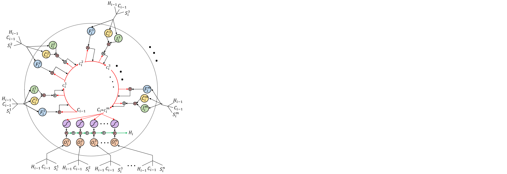

# Multi-Perspective Long Short Term Memory



**Multi-Perspective LSTM for Joint Visual Representation Learning**<br>
Alireza Sepas-Moghaddam, Fernando Pereira, Paulo Lobato Correia, Ali Etemad<br>

CVPR'21 Paper: http://arxiv.org/abs/<br>

Abstract: *We present a novel LSTM cell architecture capable of Multi-Perspective LSTM (MP-LSTM) cell architecture learning both intra- and inter-perspective relationships available in visual sequences captured from multiple perspectives. Our architecture adopts a novel recurrent joint learning strategy that uses additional gates and memories at the cell level. We demonstrate that by using the proposed cell to create a network, more effective and richer visual representations are learned for recognition tasks. We validate the performance of our proposed architecture in the context of two multi-perspective visual recognition tasks namely lip reading and face recognition. Three relevant datasets are considered and the results are compared against fusion strategies, other existing multi-input LSTM architectures, and alternative recognition solutions. The experiments show the superior performance of our solution over the considered benchmarks, both in terms of recognition accuracy and computational complexity.*

## Requirements

* Both Linux and Windows are supported. Linux is recommended for performance and compatibility reasons.
* 64-bit Python 3.6 installation. We recommend Anaconda3 with numpy 1.19.5 or newer.
* We recommend TensorFlow 1.14, which we used for all experiments in the paper, but newer versions of TensorFlow might work as well.
* You need to use Keras 2.1.5.
* You need to use [Keras-VGGFace package](https://github.com/rcmalli/keras-vggface) to extract RESNET50 spatial embeddings. 
* One or more high-end NVIDIA GPUs, NVIDIA drivers, CUDA 10.0 toolkit. 


## Preparing Datasets

The [OuluVS2](http://www.ee.oulu.fi/research/imag/OuluVS2/index.html), [Light Field Faces in the Wild (LFFW)](http://www.img.lx.it.pt/LFFW/), and [Face Constrained (LFFC)](http://www.img.lx.it.pt/LFFW/) datasets are used to evaluate the performance of MPLSTM. After you have downloaded the dataset successfully, you need to split the data into training, validation, and testing as disscussed in [OuluVS2 paper](https://ieeexplore.ieee.org/document/7163155) and [LFFW and LFFC paper](https://ieeexplore.ieee.org/document/9343707). The organization of the files should be as follow:


| OuluVS2 Dataset | &nbsp;
| :--- | :----------
| &boxvr;&nbsp; Test | Test folder
| &boxvr;&nbsp; Train | Train folder
| &boxvr;&nbsp; Validation | Validation folder
| &ensp;&ensp; &boxvr;&nbsp; CAM1 | Camera 1 folder
| &ensp;&ensp; &boxvr;&nbsp; CAM2 | Camera 2 folder
| &ensp;&ensp; &boxvr;&nbsp; CAM3 | Camera 3 folder
| &ensp;&ensp; &ensp;&ensp; &boxvr;&nbsp; 01| Utterance 1 folder containing speach videos
| &ensp;&ensp; &ensp;&ensp; &boxvr;&nbsp; 02| Utterance 2 folder containing Speach videos
| &ensp;&ensp; &ensp;&ensp; &boxvr;&nbsp; .| .
| &ensp;&ensp; &ensp;&ensp; &boxvr;&nbsp; .| .
| &ensp;&ensp; &ensp;&ensp; &boxvr;&nbsp; .| .
| &ensp;&ensp; &ensp;&ensp; &boxvr;&nbsp; 20| Utterance 20 folder containing speach videos

| LFFW and LFFC Datasets | &nbsp;
| :--- | :----------
| &boxvr;&nbsp; Test | Test folder
| &boxvr;&nbsp; Train | Train folder
| &boxvr;&nbsp; Validation | Validation folder
| &ensp;&ensp; &boxvr;&nbsp; Hor | Horizontal viewpoint sequences floder
| &ensp;&ensp; &boxvr;&nbsp; Ver | Vertical viewpoint sequences folder
| &ensp;&ensp; &ensp;&ensp; &boxvr;&nbsp; 01| Subject 1 folder containing horizontal/vertical videos 
| &ensp;&ensp; &ensp;&ensp; &boxvr;&nbsp; 02| Subject 2 folder containing horizontal/vertical videos
| &ensp;&ensp; &ensp;&ensp; &boxvr;&nbsp; .| .
| &ensp;&ensp; &ensp;&ensp; &boxvr;&nbsp; .| .
| &ensp;&ensp; &ensp;&ensp; &boxvr;&nbsp; .| .
| &ensp;&ensp; &ensp;&ensp; &boxvr;&nbsp; 53| Subject 53 folder containing horizontal/vertical videos


## Training and Testing

## Inquiries

For inquiries, please contact [alireza.sepasmoghaddam@queensu.ca](mailto:alireza.sepasmoghaddam@queensu.ca)<br>

## Citation

```
@inproceedings{Sepas2021MPLSTM,
  title     = {Multi-Perspective {LSTM} for Joint Visual Representation Learning},
  author    = {Alireza Sepas-Moghaddam and Fernando Pereira and Paulo Lobato Correia and Ali Etemad},
  booktitle = {IEEE/CVF Conference on Computer Vision and Pattern Recognition},
  year      = {2021}
}
```
